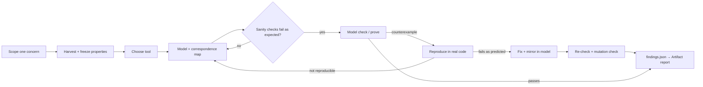

# Workflows W1–W8

The canonical, agent-facing version is
`skills/formal-verify/references/workflows.md`. This page is the
human-facing overview.

## Details

| ID | Workflow | Trigger (user says…) | Main skill | Output |
|---|---|---|---|---|
| W1 | Bug hunt | "find the race", "why do we double-charge", "is this thread-safe" | formal-verify → tlaplus-model / lean-model | confirmed findings, fixes, report |
| W2 | Change review | "does this PR introduce races" | formal-verify | per-finding verdict: introduced / pre-existing / fixed |
| W3 | Design verification | "check this protocol / RFC before we build it" | tlaplus-model | an executable design, the invariants, a test plan |
| W4 | Proof-guided simplification | "do we still need this lock / check / retry" | proof-simplify | proven-safe deletions, report |
| W5 | Regression guard | "keep this verified", "add the spec to CI" | formal-verify | CI jobs, bug-mode configs that must fail |
| W6 | Drift check | "the code changed; is the spec still right" | formal-verify | drift list, updated model |
| W7 | Escalate TLA+ → Lean | "prove it for all N" | lean-model | unbounded theorems plus bounded TLC results |
| W8 | Explain a trace | pastes TLC/Apalache/Quint output | tlaplus-model | domain-language story, verdict |

### W1, the core loop

### Typical chains

- **W1 → W4 → W5:** fix bugs, simplify with what was proven, lock it in CI.
- **W3 → implement → W6 → W5:** verify the design, build it, check conformance, guard it.
- **W2 → W1:** a PR review that finds a pre-existing bug becomes a hunt.
- **W1 (TLA+) → W7 (Lean) → W4:** bounded check, unbounded proof, then simplify.

Related: [formal-verify story](../stories/formal-verify-orchestrator-skill.md),
[proof-simplify story](../stories/proof-simplify-skill.md).
